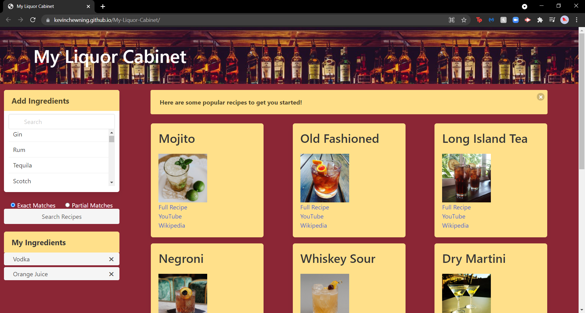

# My-Liquor-Cabinet

## About

A website built to show cocktail recipes maching the ingredients available to the user. If that is not possible a near match to a cocktail with the majority of the ingredients. 

When you first enter you will be greeted by a message informing you on how to use the search function. 

Before you search you will be prompted with the most popular searches if you do not have a starting point. Otherwise pick from the dropdown list of ingredients or search a more specified brand/subject. Then select search, upon the search you will have a card presented to you with an image of the cocktail and links to the recipe, a pertinent youtube video, and a wikipedia summary. 

A modal with the full recipe will appear when the recipe link is clicked. The youtube link and wikipedia link will redirect you to website with the exact information.

Selected ingredients will be shown within under the my ingredients tab. 

## Built with

*HTML
*CSS
*Javascript
*Bulma
*JQuery

## Website 

https://kevinchewning.github.io/My-Liquor-Cabinet/

